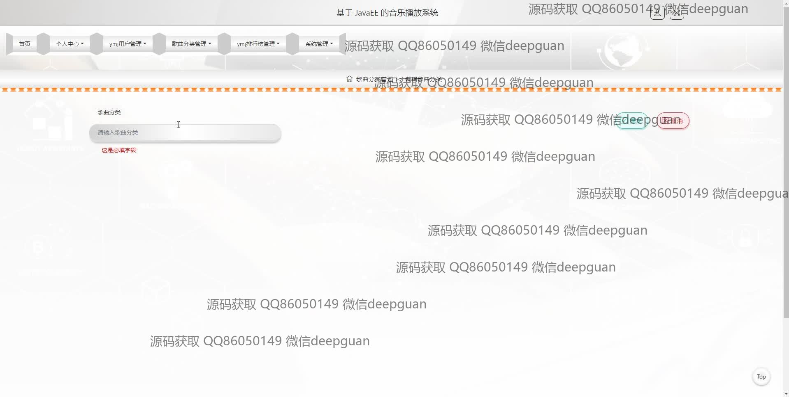

<h1 align="center">基于 JavaEE 的音乐播放系统</h1>

## 简介
基于JavaEE的音乐播放系统：角色分为管理员和用户；功能包括首页、音乐排行榜、歌曲分类管理、音乐资讯、用户和系统管理，实现音乐上传、播放、分类和管理。    --计算机毕业设计源码；毕设源码；java毕业设计源码

## 联系方式

<h3 align="center">获取完整代码与数据库文件 + 微信：deepguan QQ: 86050149 QQ群: 783742310</h3>

<h3 align="center">可帮忙远程部署 包运行成功！提供远程部署、修改代码、设计文档指导、代码讲解等服务！</h3>

## 功能介绍（完整见运行截图）
管理员：登录、注册、退出功能；管理用户信息，包括新增、修改和删除；编辑和分类歌曲信息，支持歌曲上传、分类管理、排行榜管理及资讯管理；管理首页内容和系统设置，支持音乐推荐和浏览模块的调整；支持编辑关于我们页面，添加或删除图像及修改标题和简介。

用户：登录、注册、退出功能；浏览首页内容，包括排行榜、精选资讯、音乐分类和推荐；搜索歌曲、查看歌曲详情和专辑信息；支持添加评论、查看播放记录及管理个人收藏；通过个人中心查看和修改个人信息，管理上传的头像及联系方式。

## 运行截图

本代码来源于网络,仅供学习参考使用!

